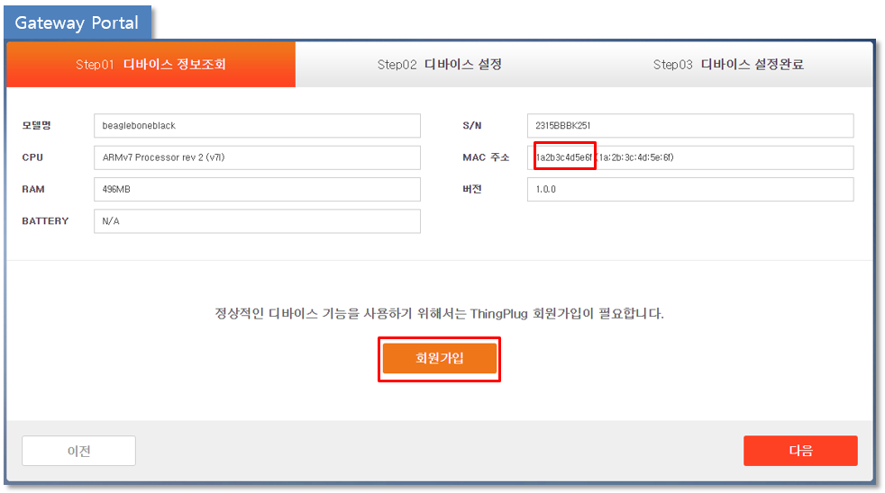
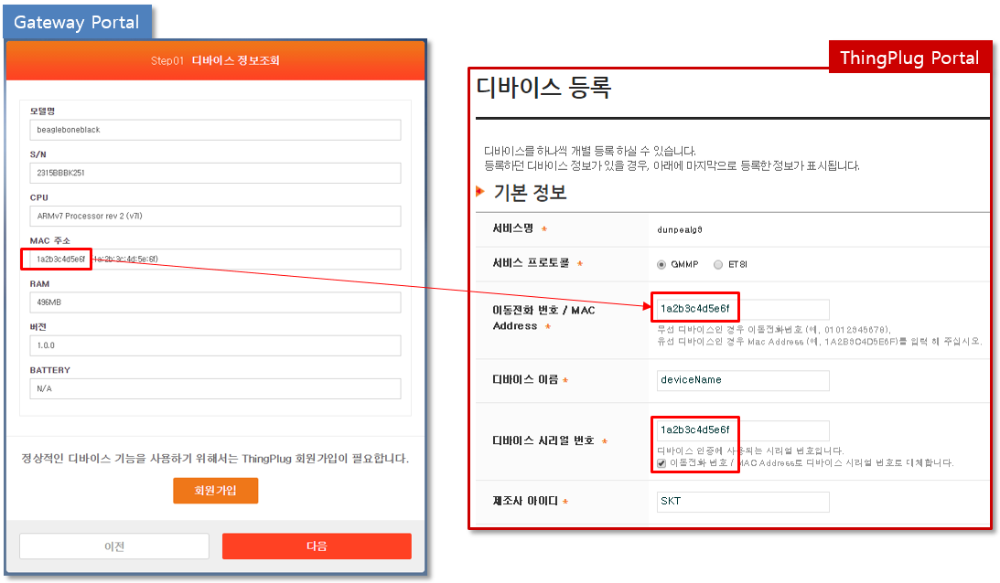
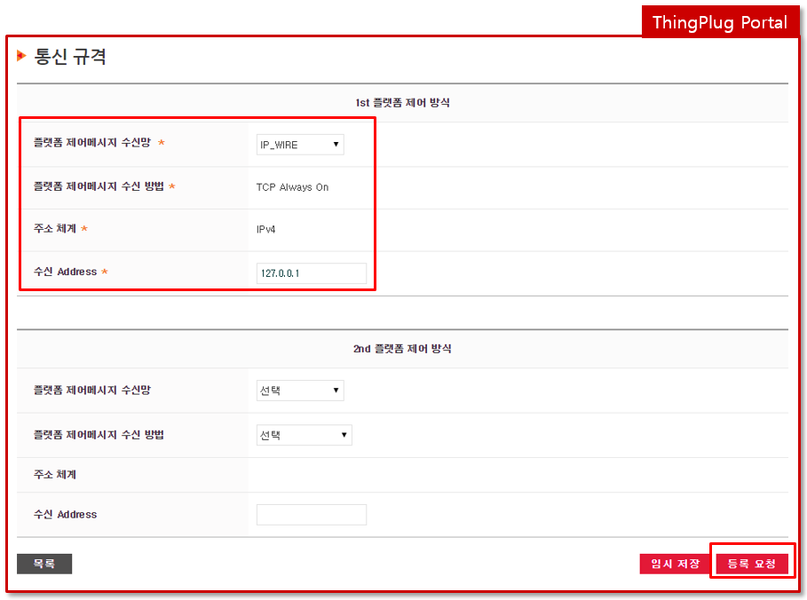
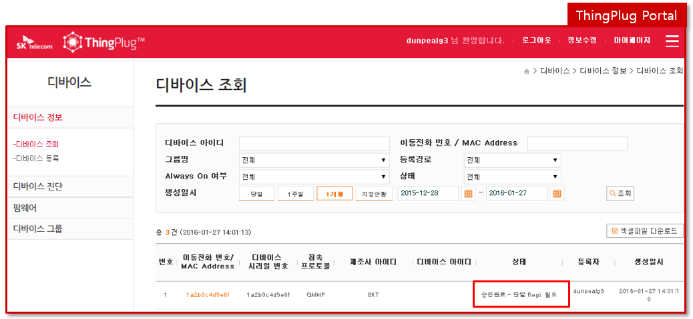
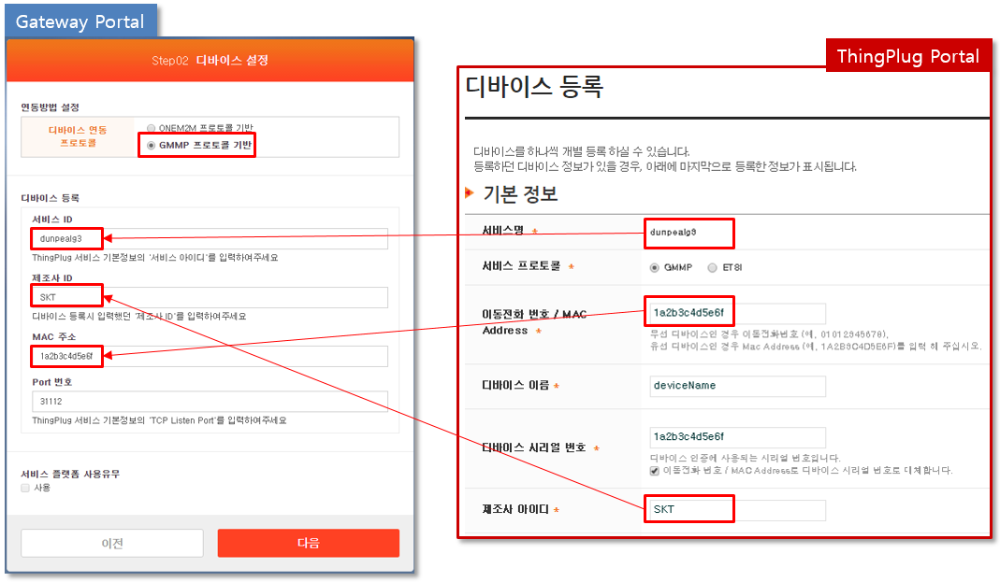

## ThingPlug Device 미들웨어 GMMP 등록 가이드
본 챕터는 Device 를 GMMP 방식으로 등록하는 방법을 서술한다.

#### 1. SKT ThingPlug 회원 가입
0. thingplug.sktiot.com 접속
1. GMMP 는 디바이스 연동 프로토콜 선택에서 TCP 를 선택한다.

#### 2. Gateway Portal 간편 세팅
* 브라우저에서 http://IP-address:8000 번으로 접속하여 로그인 한다.

#### 3. Gateway Portal 정보 확인 
0. 모델명, CPU, S/N, MAC 주소 등을 확인할 수 있다.
1. MAC 주소 정보는 GMMP Gateway 등록시 필요한 정보이니 copy 해두자.
2. 회원가입 버튼을 통하여 ThingPlug Portal로 이동 가능하다.

#### 4. GMMP 등록
* thingplug.sktiot.com 접속
* 디바이스 개별등록 메뉴를 통하여 등록을 진행한다.

* MAC 주소는 Gateway Portal > 간편세팅의 MAC 주소 정보를 Copy 해서 입력한다.

* 기본 정보와 통신 규격의 필수정보는 모두 입력 후 등록 요청한다.

* 승인완료-단말 Regi. 필요 로 표시되면 Gateway Portal 을 통한 단말 Registration이 가능하다.

* ThingPlug Portal 에서 등록시 사용한 정보를 카피하여 Registration 을 진행한다.

* ThingPlug Portal 마이페이지 > 서비스 정보수정 에서 TCP Listen Port 정보를 카피하여 Registration 을 진행한다.

* Registration 이 정상적으로 완료되면 Step03 으로 이동된다.
* 서비스 시작하기를 클릭한다.

* ThingPlug Portal 에서 등록완료-서비스 가능 문구를 확인한다.

