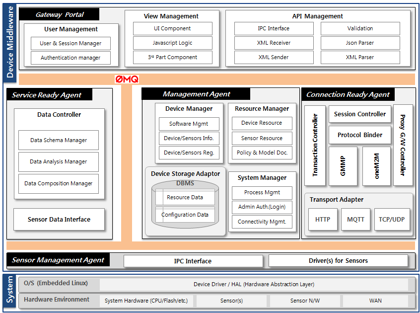
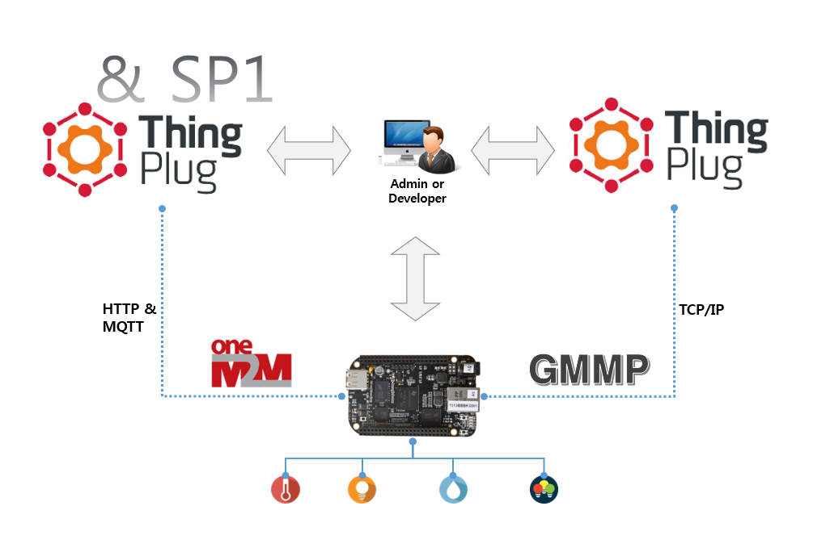

#### 2016년 4월 14일 - Version: 1.0.1

## ThingPlug를 위한 Device 미들웨어 설치 및 실행가이드
본 챕터는 SKT ThingPlug Device 미들웨어 설치 및 실행 방법을 서술한다.

#### 1. ThingPlug Device 미들웨어 란?
개방형 사물인터넷 서버 플랫폼 ThingPlug 를 위한 Device 미들웨어는 ThingPlug 와의 연동을 쉽게 해주고 다양한 Device 에 적용 가능한, Device 개발자 및 서비스 개발자를 위한 소프트웨어이다.

* 미들웨어는 총 4개의 모듈과 5개의 에이전트로 구성되어 있으며, 각각의 모듈간 통신을 통해 사물과 ThingPlug 간 연동을 수행한다.
* **Management Agent** 는 미들웨어 내부의 모든 명령 및 처리의 중심에서 실제적인 역할을 수행한다. User 와의 외부 Interface 는 Gateway Portal, ThingPlug 와는 Connection Ready Agent 와 연동하며, 내부 Device/Sensor 와는 Service Ready Agent 를 통해 연동한다.
* **Connection Ready Agent** 는 GMMP Protocol 과 oneM2M Protocol 을 모두 지원하며, ThingPlug 서버와 통신을 담당한다. oneM2M 의 경우 HTTP/MQTT 방식을 사용하고, GMMP 는 TCP/IP 방식을 사용한다.
* **Service Ready Agent** 는 Sensor Management Agent 로 부터 센서 관련 정보들을 전달받아, 센서별 정책에 따라 데이터를 가공하는 역할을 한다. 가공된 센서 정보는 Management Agent 로 전달한다.
* **Sensor Management Agent** 는 센서 데이터를 수집하고, 직접 제어를 담당하며, Service Ready Agent 와 데이터를 주고 받는다.
* **Gateway Portal** 은 관리자/개발자가 미들웨어 시스템을 제어하고, 각종 정보를 조회할 수 있는 사용자 인터페이스이며, Node.js 기반의 어플리케이션으로 구현되어 있다.

#### 2. ThingPlug 와의 연동 구조
ThingPlug 와의 Protocol 은 oneM2M 과 GMMP 두가지 방식을 지원 하며, 정보를 실시간으로 조회 및 제어할 수 있는 SP1 과의 연동은 현재 oneM2M 방식만 지원한다.



#### 3. 지원 사양 및 하드웨어
* 권장 사양
  * Memory : 128 Mb 이상
  * CPU : 200MHz 이상
* 지원 하드웨어
  * Raspberry Pi2, BeagleBone Black 외 ARM/Linux 디바이스

#### 4. 환경 설정

0. 윈도우 사용자의 경우 아래의 URL 에서 putty 를 다운받아 설치한다.
	* http://www.chiark.greenend.org.uk/~sgtatham/putty/download.html
1. 인터넷 연결을 위하여 Ethernet(LAN 케이블)이나 Wi-Fi USB 동글을 장치에 연결한다.
2. 터미널(윈도우 PC에서는 putty)을 열고 각 장치 환경에 따라 네트워크 환경을 설정한다.
3. 처음 실행하는 장치를 업데이트 및 업그레이드 한다.

	```
	# apt-get update
	# apt-get upgrade
	```

#### 5. 미들웨어에서 사용하는 Library 안내
미들웨어에서 사용하는 Library 들은 다음과 같다.
<table>
<thead><tr><th>Part</th><th>Library</th><th>Type</th><th>용도</th></tr></thead>
<tbody>
<tr><td rowspan="7">Gateway Portal</td><td>express</td><td>패키지 포함</td><td>프레임워크</td></tr>
<tr><td>express-session</td><td>패키지 포함</td><td>Express 에 Session 추가</td></tr>
<tr><td>body-parser</td><td>패키지 포함</td><td>Express 에 BodyParser 추가</td></tr>
<tr><td>request</td><td>패키지 포함</td><td>http request 전송</td></tr>
<tr><td>xml2js</td><td>패키지 포함</td><td>XML 파싱</td></tr>
<tr><td>ping</td><td>패키지 포함</td><td>Ping 체크</td></tr>
<tr><td>i18n</td><td>패키지 포함</td><td>다국어 지원</td></tr>
<tr><td rowspan="4">Management Agent</td><td>libcurl</td><td>패키지 포함</td><td>HTTP 통신</td></tr>
<tr><td>libmosquitto</td><td>패키지 포함</td><td>MQTT 통신</td></tr>
<tr><td>libxml2</td><td>shared</td><td>XML 데이터 처리</td></tr>
<tr><td>libsqlite3</td><td>shared</td><td>데이터 저장</td></tr>
<tr><td rowspan="2">공용</td><td>libsodium</td><td>패키지 포함</td><td>IPC 통신</td></tr>
<tr><td>lizeromq</td><td>패키지 포함</td><td>IPC 통신</td></tr>
</tbody>
</table>

#### 6. 패키지 설치
0. 데비안 패키지 파일을 다운로드 한다.

	```
	# wget https://raw.githubusercontent.com/SKT-ThingPlug/thingplug-device-middleware/master/pkg/devicemiddleware_ARM_0.9.0_1604281847.deb
	```

1. 데비안 패키지를 설치한다.(반드시 root 계정을 이용해야 한다.)	

	* 일반적으로 dpkg 명령을 통하여 패키지를 설치한다.
	```
	# dpkg -i devicemiddleware_ARM_0.9.0_1604281847.deb
	```
	* Library dependencies 등의 문제가 발생할 경우 gdebi 를 이용하여 패키지를 설치한다.
	```
	# apt-get install gdebi
	# gdebi devicemiddleware_ARM_0.9.0_1604281847.deb
	```

#### 7. 패키지 설치 확인
* 브라우저에서 http://IP-address:8000 번으로 접속하여 다음과 같은 화면(Gateway Portal)이 나오면 모든 설치가 완료된 것이다.  

> 로그인 화면에서 아이디 / 비밀번호 : thingplugadmin / adminthingplug (최초 로그인 후 반드시 비밀번호 변경요망)

* 관리자 계정 비밀번호 변경하기

> 환경설정 > 관리자설정 메뉴에서 계정 비밀번호를 변경할 수 있다.

#### 8. 사용 방법
0. 정지

	```
	# service middleware stop
	```

1. 시작

	```
	# service middleware start
	```

2. 재시작

	```
	# service middleware restart
	```

3. 구동 확인

	```
	# ps xl | grep middleware
	```

4. 제거
	* usr/local/middleware 내부의 모든 파일이 삭제되니 필요한 경우 백업이 필요함

	```
	# dpkg -r devicemiddleware
	```

#### 9. 장치 등록
* HTTP 연동 규격 가입자
  * [ThingPlug Device 미들웨어 oneM2M 등록 가이드](oneM2M_Guide.md)
* TCP 연동 규격 가입자
  * [ThingPlug Device 미들웨어 GMMP 등록 가이드](GMMP_Guide.md)

#### 10. 센서
* [센서 연동 가이드](Sensor_Guide.md)
* [BeagleBone Black 장치의 센서 드라이버 설치 가이드](BBB_Sensor_Installation.md)
