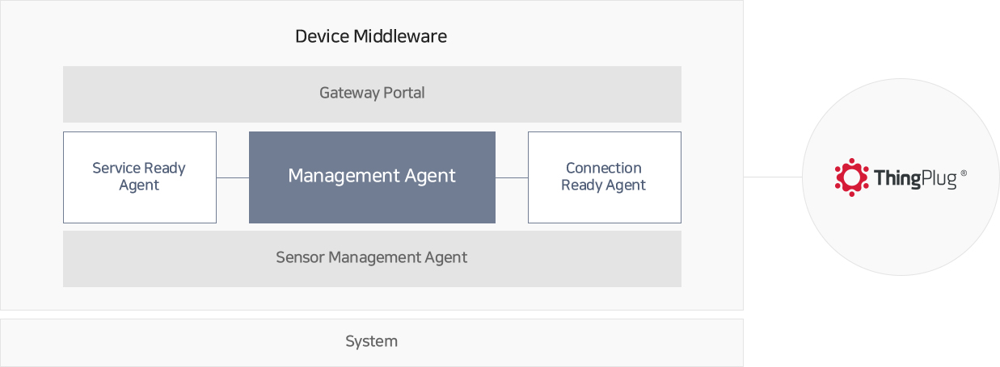
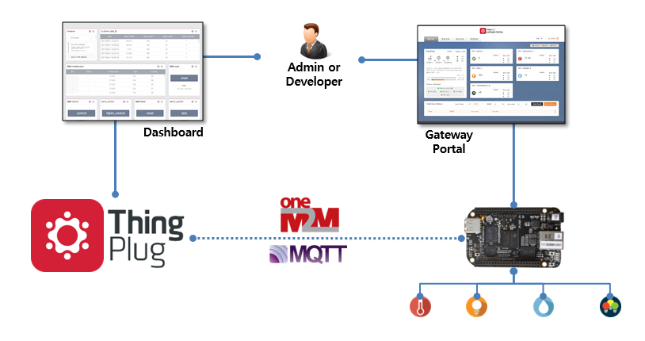
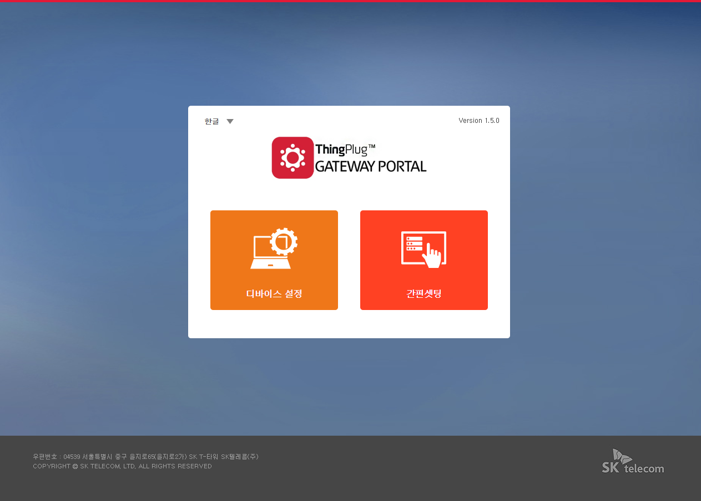
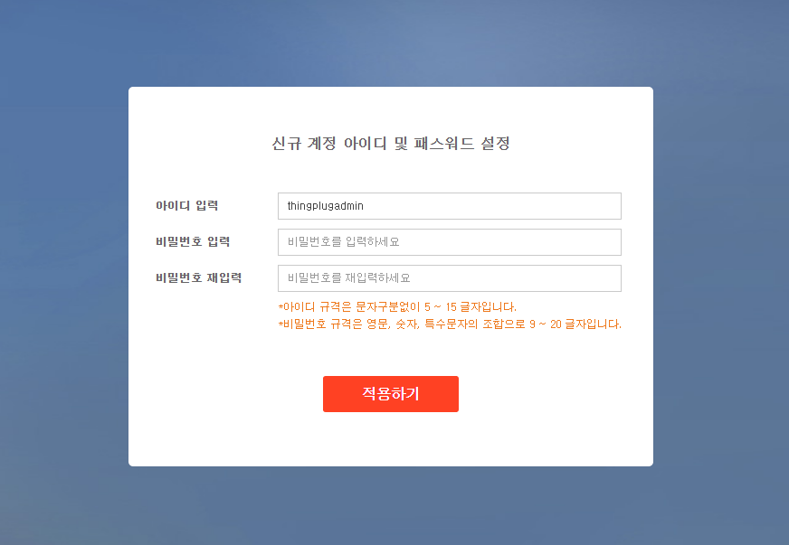
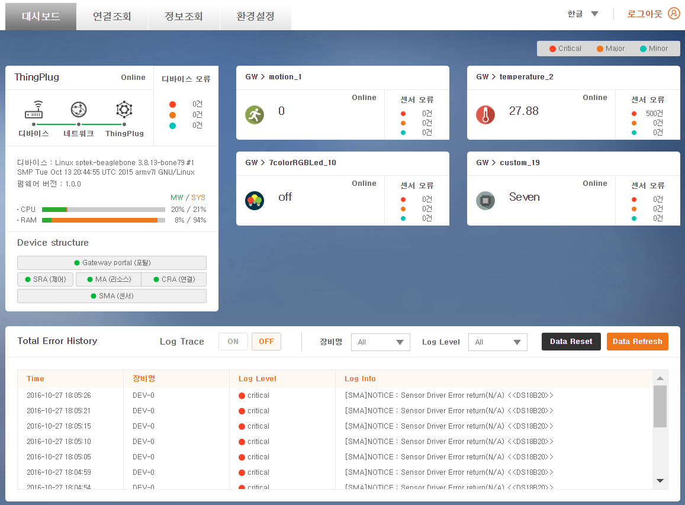

#### 2017년 6월 28일 - Version: 1.5.0

## ThingPlug를 위한 Device 미들웨어 설치 및 실행가이드
SKT ThingPlug Device 미들웨어 설치 및 실행 방법을 설명합니다.

#### ThingPlug Device 미들웨어 란?
개방형 사물인터넷 플랫폼 ThingPlug 를 위한 Device 미들웨어는 ThingPlug 와의 연동을 쉽게 해주고 다양한 Device 에 적용 가능한, Device 개발자를 위한 소프트웨어입니다.

* 미들웨어는 총 3개의 모듈과 5개의 에이전트로 구성되어 있으며, 각각의 모듈간 통신을 통해 사물과 ThingPlug 간 연동을 수행합니다.
* **Management Agent** 는 미들웨어 내부의 모든 명령 및 처리의 중심에서 실제적인 역할을 수행합니다. 사용자와의 Interface 를 담당하는 Gateway Portal 과 연동하며, Connection Ready Agent와 Service Ready Agent 를 포함합니다.
* **Connection Ready Agent** 는 oneM2M Protocol 을 지원하며, ThingPlug 서버와 통신을 담당합니다. oneM2M 의 경우 MQTT(S) 방식을 사용합니다.
* **Service Ready Agent** 는 Sensor Management Agent 로 부터 전달받은 센서 관련 정보들을, 데이터 포맷 정의서에 따라서 데이터를 가공하는 역할을 합니다.
* **Sensor Management Agent** 는 센서 데이터를 수집하고, 직접 제어를 담당하며, Management Agent 와 데이터를 주고 받습니다.
* **Gateway Portal** 은 관리자/개발자가 미들웨어 시스템을 제어하고, 각종 정보를 조회할 수 있는 사용자 인터페이스이며, Node.js 기반의 어플리케이션으로 구현되어 있습니다.

#### ThingPlug 와의 연동 구조
ThingPlug 와의 Protocol 은 oneM2M 방식을 지원하며, 플랫폼의 대시보드 또는 미들웨어의 Gateway Portal 을 통하여 모니터링할 수 있습니다.



#### 지원 사양 및 하드웨어
* 권장 사양
  * Memory : 128 Mb 이상
  * CPU : 200MHz 이상
* 지원 하드웨어
  * Raspberry Pi2/3, BeagleBone Black 외 ARM/Linux 디바이스

#### 환경 설정

* 윈도우 사용자의 경우 아래의 URL 에서 putty 를 다운받아 설치합니다.
  * http://www.chiark.greenend.org.uk/~sgtatham/putty/download.html
* 인터넷 연결을 위하여 Ethernet(LAN 케이블)이나 Wi-Fi USB 동글을 장치에 연결합니다.
* 터미널(윈도우 PC에서는 putty)을 열고 각 장치 환경에 따라 네트워크 환경을 설정합니다.
* 패키지 관리자를 최신 버전으로 업데이트 및 업그레이드 합니다.

	```
	# apt-get update
	# apt-get upgrade
	```

#### 미들웨어에서 사용하는 Library 안내
미들웨어에서 사용하는 Library 들은 다음과 같습니다.
<table>
<thead><tr><th>Part</th><th>Library</th><th>Type</th><th>용도</th></tr></thead>
<tbody>
<tr><td rowspan="7">Gateway Portal</td><td>express</td><td>패키지 포함</td><td>프레임워크</td></tr>
<tr><td>express-session</td><td>패키지 포함</td><td>Express 에 Session 추가</td></tr>
<tr><td>body-parser</td><td>패키지 포함</td><td>Express 에 BodyParser 추가</td></tr>
<tr><td>request</td><td>패키지 포함</td><td>http request 전송</td></tr>
<tr><td>xml2js</td><td>패키지 포함</td><td>XML 파싱</td></tr>
<tr><td>ping</td><td>패키지 포함</td><td>Ping 체크</td></tr>
<tr><td>i18n</td><td>패키지 포함</td><td>다국어 지원</td></tr>
<tr><td rowspan="2">Management Agent</td><td>libpaho-mqtt3as</td><td>패키지 포함</td><td>MQTT TLS 통신</td></tr>
<tr><td>libsqlite3</td><td>shared</td><td>데이터 저장</td></tr>
</tbody>
</table>

#### 패키지 설치
* 설치할 패키지 파일을 다운로드 합니다.

	```
	# wget https://raw.githubusercontent.com/SKT-ThingPlug/thingplug-device-middleware/master/pkg/thingplug_dmw_ARM_1.5.0_1708021645.deb
	```

* 패키지를 설치합니다.(root 계정을 이용해야 함)

	* 일반적으로 dpkg 명령을 통하여 패키지를 설치합니다.
	```
	# dpkg -i thingplug_dmw_ARM_1.5.0_1708021645.deb
	```
	* Library dependencies 등의 문제가 발생할 경우 gdebi 를 이용하여 패키지를 설치합니다.
	```
	# apt-get install gdebi
	# gdebi thingplug_dmw_ARM_1.5.0_1708021645.deb
	```

#### 패키지 설치 확인
* 브라우저에서 http://IP-address:8000 번으로 접속하여 다음과 같은 화면(Gateway Portal)이 나오면 모든 설치가 완료된 것입니다.  

> 로그인 화면에서 아이디 / 비밀번호 : thingplugadmin / [mac-address(:제외)] 입력

* 최초 로그인시에 계정 등록이 필요합니다.

> 안내에 따라 원하는 아이디와 비밀번호를 적용합니다.

* 등록한 계정으로 로그인하면 대시보드를 확인할 수 있습니다.


* 관리자 계정 비밀번호 변경하기

> 환경설정 > 관리자설정 메뉴에서 계정 비밀번호를 변경할 수 있습니다.

#### 사용 방법
* 정지

	```
	# service middleware stop
	```

* 시작

	```
	# service middleware start
	```

* 재시작

	```
	# service middleware restart
	```

* 구동 확인

	```
	# ps xl | grep middleware
	```

* 제거
	* 제거 후 usr/local/middleware 내부의 resource.db 파일, log 폴더가 남겨지며, conf 폴더의 파일들은 /tmp/middleware_backup 폴더로 복사되어 남겨집니다.

	```
	# dpkg -r devicemiddleware
	```

#### 장치 등록
* [ThingPlug Device 미들웨어 플랫폼 등록 가이드](oneM2M_Guide.md)

#### 센서
* [센서 연동 가이드](Sensor_Guide.md)
* [BeagleBone Black 장치의 센서 드라이버 설치 가이드](BBB_Sensor_Installation.md)

#### oneM2M
* [oneM2M 등록과 주기보고 및 제어하기](oneM2M_Flow&Report_Guide.md)


Copyright (c) 2017 SK Telecom Co., Ltd. All Rights Reserved.
