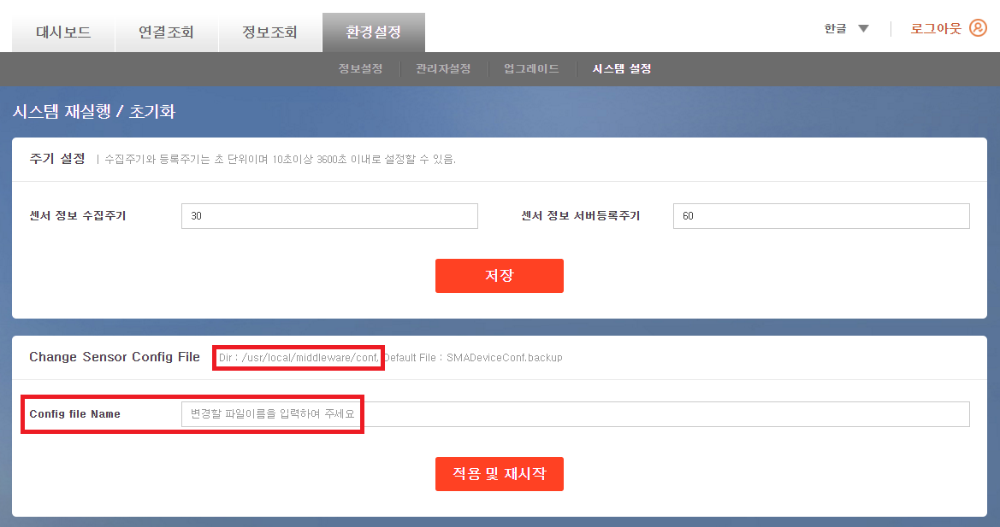

# 센서 연동 가이드

본 챕터는 Sensor 와 Actuator 조회 및 제어를 담당하는 **Sensor Management Agent**(SMA) 에 대한 소개와 직접 수정을위한 가이드를 제공한다.

### 1. 개요
SMA 는 Sensor 들을 관리하고, 데이터를 수집한다.
다양한 센서 입/출력을 처리하기 위한 Common Interface 로 개발하였다. 

### 2. SensorManagementAgent 구조도
아래 그림은 센서 처리를 위한 SensorManagementAgent 의 전체 구조도이다.


#### 2.1. Sensor Handler
* **Sensor Handler** 모듈은 센서 관리의 핵심 역활을 수행한다. 등록된 센서의 초기화, 제어, 데이터 추출, 종료 함수를 관리 및 실행한다.
* **Sensor Interface** 에는 센서 관련 함수가 모여있으며, 각 센서별로 하나의 file 을 갖는다.
* 초기화 시 모든 센서의 초기화 함수를 실행한다.
* 센서의 초기화 함수에서는 자신의 제어명령이 있을 경우, 제어함수를 Control Command List 에 등록한다.
* 각 센서의 초기화가 완료되면, 주기적으로 센서값을 읽는 함수를 알람 시그널에 등록한다.
* 주기적으로 읽는 데이터는 **Configuration** 에 update 된다.
* Command 에 따라 센서 제어가 필요할 경우, **Control Command List** 에서 일치하는 제어함수를 실행한다.
* 주기적으로 해당 센서가 정상동작하는지 확인한다.
* 프로세스가 종료될 때 모든 센서의 종료 함수를 실행한다.

#### 2.2. Sensor Configuration
* Sensor Configuration 은 SMA 에서 동작할 센서에 대한 설정값을 저장한다.
* 관련 코드는 `/usr/local/middleware/SMA/source/configuration/SensorConfiguration.c` 파일에 있으며,
`/usr/local/middleware/conf/SMADeviceConf.backup` 파일이 존재하면 **SMADeviceConf.backup** 파일의 정보로 로딩된다.
* 사용자가 관리하고자 하는 센서목록을 정하고, 이를 Sensor Configuration 에 반영하는 작업은 필수이다.
* 설정 값을 정리하면 다음과 같다.

  * DeviceID : SMA에서 자동으로 세팅하여 사용하기 때문에 필드에 존재하지만 거의 사용하지 않는다.
  * SensorID : 센서를 구분하는 기준값이다. 10자리로 구현되어 있으며 숫자로 되어 있다. 중복되는 값이 들어가지 않도록 한다. (예)0000000001,000000002
  * SensorName : Sensor의 모델명이다. (예) DS18B20, CM1001
  * SensorType : Sensor의 종류를 나타낸다. (예) 온도, 습도
  * EnableFlag : 장치가 활성되었는지 여부.
  * ReadInterval : 센서를 읽는 주기 (초)
  * ReadMode : 센서를 읽는 방식 (예) polling, request, event
  * LastValue : Sensor의 마지막 데이터
  * StartTime : 데이터에 변화가 있는 시점
  * EndTime : 데이터에 변화가 없는 시점
  * SerialNumber : 센서의 시리얼 넘버
  * OperationType : 센서 구동 타입 (예) active, passive
  * MaxInterval : 데이터 변화 없어도 허용되는 최대 시간(초)
  * ControlType : SP1 Control Type 여부
  * RegisterFlag : SMA->SRA->MA로 센서를 등록 할지 여부

* **SENSOR_CONFIGURATION_T** 구조체 구성표
<table>
<thead><tr><th>구조체 멤버</th><th>변수 타입</th><th>기타</th></tr></thead>
<tbody>
<tr><td>DeviceID</td><td>String</td><td>최대길이 32byte</td></tr>
<tr><td>SensorID</td><td>String</td><td>최대길이 32byte</td></tr>
<tr><td>SensorName</td><td>String</td><td>최대길이 64byte</td></tr>
<tr><td>SensorType</td><td>String</td><td>최대길이 32byte</td></tr>
<tr><td>EnableFlag</td><td>Enum</td><td>SENSOR_STATE_DISABLE = 0<br>SENSOR_STATE_ENABLE = 1</td></tr>
<tr><td>ReadInterval</td><td>Int</td><td>seconds</td></tr>
<tr><td>ReadMode</td><td>Enum</td><td>SENSOR_MODE_POLLING = 0<br>SENSOR_MODE_REQUEST = 1<br>SENSOR_MODE_EVENT = 2</td></tr>
<tr><td>LastValue</td><td>String</td><td>MAX_LEN_LAST_VALUE = 32</td></tr>
<tr><td>StartTime</td><td>Int</td><td></td></tr>
<tr><td>EndTime</td><td>Int</td><td></td></tr>
<tr><td>SerialNumber</td><td>String</td><td>MAX_LEN_SERIAL_NUMBER=64</td></tr>
<tr><td>OperationType</td><td>Enum</td><td>SENSOR_ACTIVE_TYPE: 0x0001<br>SENSOR_PASSIVE_TYPE:0x0002</td></tr>
<tr><td>MaxInterval</td><td>Int</td><td>Value < 0 은 경우 on/off 판단불가<br>양수일 경우 시간만큼 Sensor Data 변화 없을 시 off 로 전환</td></tr>
<tr><td>ControlType</td><td>Int</td><td>1 = SP1 Control Type<br>2 = No SP1 Control Type</td></tr>
<tr><td>RegisterFlag</td><td>Int</td><td>0 = MA에 등록하지 않음<br>1 = MA에등록<br>값이 0이면장치에 센서가 연결되어 동작하더라도 MA에는등록하지 않음</td></tr>
</tbody>
</table>

#### 2.3. Sensor Interface
* 센서에 직접적으로 작동하는 함수를 모아놓은 파일이다. 
* 각 센서별로 하나의 파일이 존재하며, 내부적으로 초기화 함수, 제어 함수, 데이터 추출 함수, 종료 함수가 구현된다.
* 구현된 함수를 Sensor Handler 에 등록한다.

#### 2.4. Control Command List
* 센서의 제어명령들을 관리하는 리스트이다.
* 링크 리스트로 구현되어 있으며, Sensor Interface 의 제어명령에 대한 함수명과 함수포인터를 저장하고 있다.
* 제어 명령이 도착하면, 함수명을 확인하고 함수를 호출한다.

#### 2.5. Command
* SRA 에서 센서 관리에 관련된 명령이 도착하면 Command file 에서 Sensor Handler 의 함수를 호출하여, 선택된 센서의 명령을 처리한다.
* 센서의 값을 확인하거나, 설정을 바꾸거나, 제어를 할 수 있다.

### 3. 폴더 구조
SensorManagementAgent 프로젝트는 미들웨어 패키지 설치 후, `/usr/local/middleware/SMA` 에서 확인 가능하다.


#### 3.1 include 폴더
* SMA 에서 사용하는 각종 데이터 포맷, 에러 정의 등 포함되어 있다.
* 미공개 코드에 대한 헤더정보들도 포함되어 있다.

#### 3.2 lib 폴더
* SMA 에서 사용하는 libsmalib.a 가 포함되어 있다.

#### 3.3 command 폴더
* command 는 종류에 따라 각 파일로 존재하며, 내부적으로 명령에 맞는 작업을 수행한다.
* 모든 command 는 공통적으로 Packet 내용을 분석하며, 개별적으로 센서를 컨트롤 하거나, 값을 수정하는 작업이 수행한다. 
* command 수행 결과에 대한 응답 Packet 을 생성하여, Command Executer 에게 전달한다.

* 공개 Command List
  * DeviceSensorControl : 제어 Command 처리
  * GetDeviceSensorInfo : 센서 정보 처리
  * GetDeviceSensorStatus : 센서 상태 처리

#### 3.4 configuration 폴더
Sensor에 관련된 설정 값을 Default 값으로 설정하거나, 입력 받아서 값을 보관하고, 설정 값을 추가, 변경, 삭제하는 작업을 수행한다.
(자세한 사항은 2.2 절을 참고한다.)

#### 3.5 sensor 폴더
* 연결 interface 에 따라 1W/GPIO/I2C/UART/CUSTOM/UNDIFINED 각 폴더에 센서정보를 직접적으로 관장하는 파일집합이 존재한다. 
* 각 파일은 센서의 이름으로 네이밍되며, 내부적으로 초기화, 데이터 읽기, 제어, 종료 등 센서 의존도가 높은 코드가 존재한다.

* Component
  * SensorHandler : 명령어를 통해 수행되는 작업 중 센서와 관련된 작업들을 다룬다.
   수많은 센서에 대해 일괄된 방식의 초기화, 접근, 종료를 가능하게 하는 것이 SensorHandler 의 역할이다.
  * SensorCommandList : Sensor의 제어를 위해 존재하며, 해당 모듈에서 제어 명령에 대한 리스트를 관리한다.
   센서 초기화 시 제어 명령을 등록할 수 있다.

### 4. 새로운 센서 추가하기
* 센서의 추가/수정/삭제 처리를 위하여 SMA 의 일부 코드를 제공한다.
* SMA 코드의 위치는 `/usr/local/middleware/SMA/` 폴더에서 확인 가능하다.
* 센서 추가는 아래 과정으로 진행 한다.

* 추가된 파일은 Makefile 에 등록 후 `make` 명령을 통하여 빌드 하고, 새로 생성된 실행 파일을 대체하여 미들웨어를 재실행 한다.

	```
	# service middleware stop
	# cp /usr/local/middleware/SMA/output/SensorManagementAgent /usr/local/middleware/SensorManagementAgent
	# service middleware start
	```

### 5. Sensor Configuration Overriding 방법
위 2.2 절에서 언급한 Sensor Configuration 은 아래 두가지 방법을 통하여 Overriding 이 가능하다.

0. **SMADeviceConf.backup** 파일을 수정 후 미들웨어 재시작 하는 방법
1. **Gateway Portal** 의 **시스템 설정** 메뉴를 이용하여 파일을 변경하는 방법
  * 아래 그림의 Change Sensor Config File 항목에서 변경 가능하다.
  * 해당 파일의 root 폴더는 `/usr/local/middleware/conf` 이며, 입력란에 입력시 해당 root 경로는 제외하고 입력해야 한다.
  * 파일 확장자는 체크하지 않는다.
  * **예시)** 적용하고자 하는 파일의 위치가 `/usr/local/middleware/conf/Sensor.conf` 일 경우, **Sensor.conf** 만 입력 후 **적용 및 재시작** 해준다.

