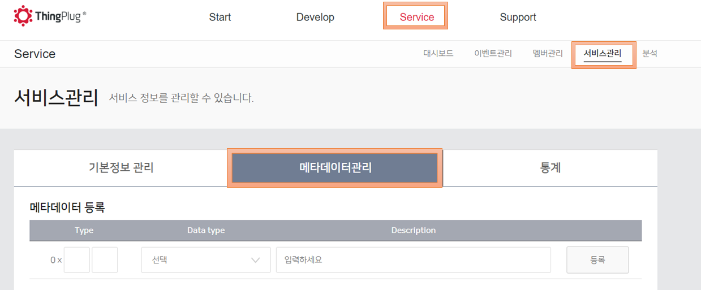
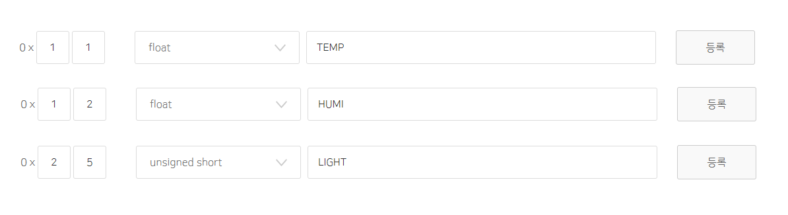
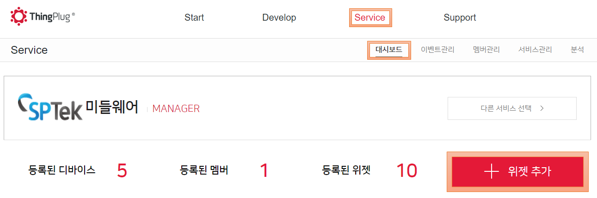
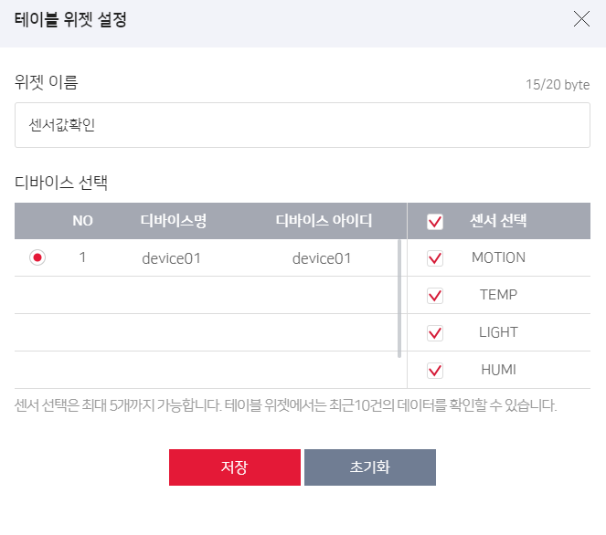
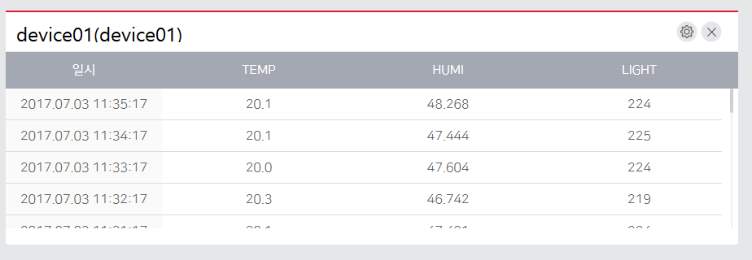
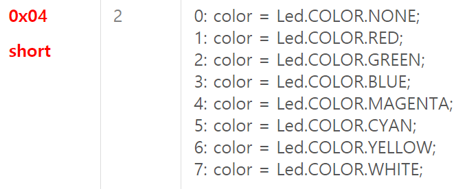
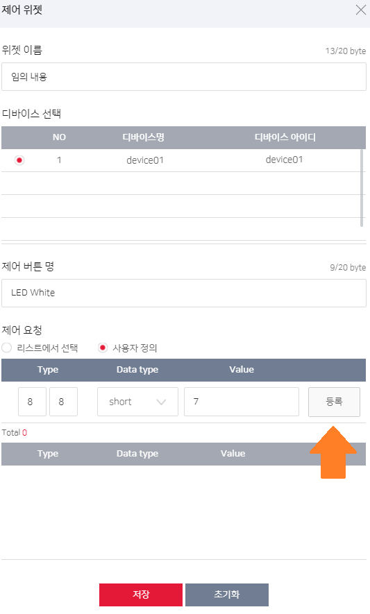
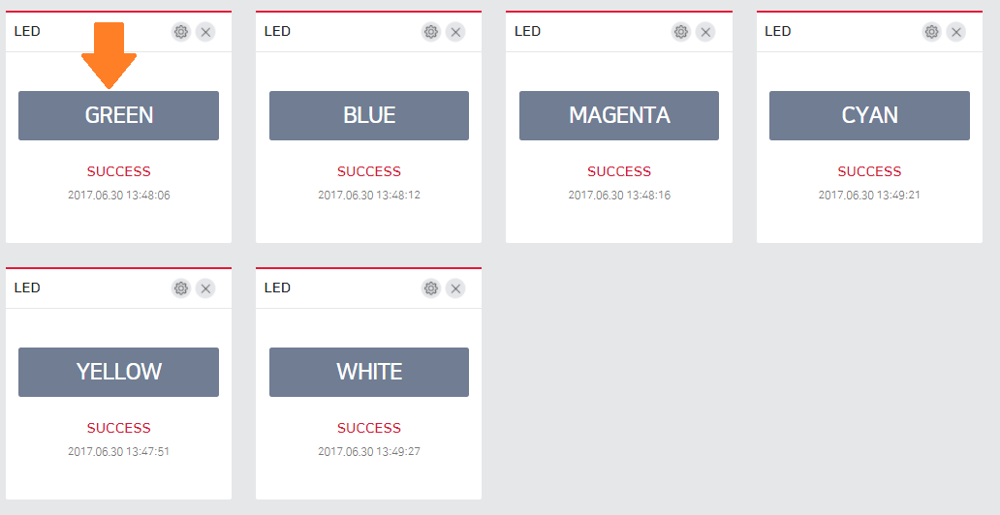

# 센서 연동 가이드

본 챕터는 Sensor 와 Actuator 조회 및 제어를 담당하는 **Sensor Management Agent**(SMA) 에 대한 소개와 포팅 개발을 위한 가이드를 제공합니다.

### 1. 개요
SMA 는 Sensor 들을 관리하고, 데이터를 수집하는 역할을 수행합니다.
다양한 센서 입/출력을 처리하기 위한 Common Interface 형태로 개발되어 있습니다. 

### 2. SensorManagementAgent 구조도
아래 그림은 센서 처리를 위한 SensorManagementAgent 의 전체 구조도입니다.


#### 2.1. Sensor Manager
**Sensor Manager** 모듈은 센서 관리의 핵심 역활을 수행합니다. 이 모듈에서는 하나의 센서를 하나의 구조체로 관리합니다. 센서 구조체는 다음과 같습니다.
```
typedef struct tagSensorOperations {
    int (*Close) (void); // 종료 함수
    int (*Read) (char *data, int *length); // 데이터 읽기 함수
    char* (*Control) (char *command, int length); // 제어 함수
}SENSOR_OPERATIONS_T;

typedef struct tagSensor {
    // User Setup Sensor Configurations
    char mID[MAX_STR_LEN]; // 센서 아이디
    char mName[MAX_STR_LEN]; // 센서 이름
    char mType[MAX_STR_LEN]; // 센서 타입
    char mReadInterval[MAX_STR_LEN]; // 데이터 읽기 주기
    int mMaxInterval; // 데이터가 불변하는 최대 주기
    unsigned short mOperationType; // 동작 타입
    unsigned short mControlType; // 제어 타입

    // Auto Setup Sensor Configurations
    char mValue[MAX_STR_LEN]; // 저장된 데이터
    int mStartTime; // 저장된 데이터 마지막 업데이트 시간
    unsigned short mStatus; // 센서 on/off

    // Sensor Operations
    SENSOR_OPERATIONS_T mOperations; // 종료 , 읽기, 제어 함수 
    pthread_mutex_t mReadMutex;
}SENSOR_T;
```
수행하는 기능은 다음과 같습니다.

* 센서 등록
* 센서 초기화
* 데이터 추출
* 센서 제어
* 센서 종료

##### 2.1.1. 센서 등록
- 센서는 (미들웨어 설치폴더)/conf/iot_sensor.conf 파일을 통해 등록됩니다. 설정 파일에서 센서이름, 설정값 등을 센서 구조체에 저장합니다. 설정파일에 대한 자세한 설명은 2.2 참조.

##### 2.1.2. 센서 초기화
- 센서 초기화는 Sensor Manager의 Init 함수 호출 시 동작합니다. 등록된 센서 각각의 Init함수를 실행하고, 데이터 읽기 함수, 제어 함수, 종료 함수를 센서 구조체에 연결합니다.

##### 2.1.3. 데이터 추출
- 센서 Read 함수를 통해 데이터를 얻습니다. 타이머를 통해 주기적으로 Read 함수가 불리게 되며, 이를 센서 구조체에 저장합니다.

##### 2.1.4. 센서 제어
- 센서 제어는 2가지로 구현되어 있다. GMMP/ONEM2M 방식과 SP1 방식이다. GMMP/ONEM2M은 SensorCommandList 모듈에서 제어를 등록 및 실행한다. 즉, 제어명령 및 함수가 별도 리스트로 관리된다. SP1 방식은 Sensor Interface 중 Control 함수를 만들고 제어 명령 시 Control 함수가 실행된다. 즉, 센서 구조체에서 제어함수가 관리된다. (SensorCommandList 자세한 설명은 2.4를 참고한다.)

##### 2.1.5. 센서 종료
- 센서 구조체에 종료 함수가 연결되어 있으며, 센서 종료 시 필요한 작업이 수행된다. SMA가 종료될 시 실행된다.

#### 2.2. Sensor Configuration
* Sensor Configuration 은 SMA 에서 등록될 센서에 대한 설정값을 저장한다.
* /usr/local/middleware/conf/iot_sensor.conf 정보가 로딩된다.
* 사용자가 관리하고자 하는 센서목록을 정하고, 이를 Sensor Configuration 에 반영하는 작업은 필수이다.
설정 값을 정리하면 다음과 같다

	* $ALL : { DeviceName } : oneM2M Container 컨테이너 생성 이름으로 사용
	* SensorType : 센서의 종류 (예) 온도, 습도
    * SensorID : 같은 종류의 센서를 구분하기 위한 ID 값
    * SensorName : 센서의 모델명 (예) DS18B20, CM1001 [중요!! 센서를 구분하는 기준이된다.]
    * ReadInterval : 센서를 읽는 주기 (milliseconds)
    * OperationType : 센서 구동 타입 (예) series,event 
    * MaxInterval : 데이터 변화 없어도 허용되는 최대 시간(seconds), 0초이면 무한대로 판단
    * ControlType : 센서 제어 가능 여부
    * TTV_Type : 센서 구분자
    * TTV_Datatype :  센서 데이터 정의 (https://thingplug.net : Support -> Download -> 서비스플랫폼 데이터포맷정의서 pdf)
    * TTV_Name : 센서 이름 정의

* **SENSOR_CONFIGURATION_T** 구조체 구성표
<table>
<thead><tr><th>구조체 멤버</th><th>변수 타입</th><th>기타</th></tr></thead>
<tbody>
<tr><td>SensorType</td><td>String</td><td>최대길이 32byte</td></tr>
<tr><td>SensorID</td><td>String</td><td>최대길이 32byte</td></tr>
<tr><td>SensorName</td><td>String</td><td>최대길이 64byte [Primary Key] </td></tr>
<tr><td>ReadInterval</td><td>Integer</td><td>milliseconds</td></tr>
<tr><td>OperationType</td><td>Integer</td><td>DM_SENSOR_EVENT_TYPE : 0x0001<br>DM_SENSOR_SERIES_TYPE:0x0002</td></tr>
<tr><td>MaxInterval</td><td>Integer</td><td>seconds</td></tr>
<tr><td>ControlType</td><td>Integer</td><td>DM_SENSOR_HAS_CONTROL_TYPE : 0x0001<br>DM_SENSOR_NO_CONTROL_TYPE : 0x0002</td></tr>
<tr><td>TTV_Type</td><td>1Byte</td><td>0x01(temp), 0x02(humi) ... etc</td></tr>
<tr><td>TTV_Datatype</td><td>1Byte</td><td>0x01(boolean),0x02(char) ...</td></tr>
<tr><td>TTV_Name</td><td>String</td><td>최대길이 32byte</td></tr>
</tbody>
</table>

#### 2.3. Sensor Interface
* 센서에 직접적으로 작동하는 함수를 모아놓은 파일입니다. 
* 각 센서별로 하나의 파일이 존재하며, 내부적으로 초기화 함수, 제어 함수, 데이터 추출 함수, 종료 함수가 구현됩니다.
* 구현된 함수를 Sensor Handler 에 등록합니다.

#### 2.4. Control Command List
* 센서의 제어명령들을 관리하는 리스트입니다.
* 링크된 리스트로 구현되어 있으며, Sensor Interface 의 제어명령에 대한 함수명과 함수포인터를 저장하고 있습니다.
* 제어 명령이 도착하면, 함수명을 확인하고 함수를 호출합니다.

#### 2.5. Command
* SRA 에서 센서 관리에 관련된 명령이 도착하면 Command file 에서 Sensor Handler 의 함수를 호출하여, 선택된 센서의 명령을 처리합니다.
* 센서의 값을 확인하거나, 설정을 바꾸거나, 제어를 할 수 있습니다.

### 3. 폴더 구조
SensorManagementAgent 프로젝트는 미들웨어 패키지 설치 후, `/usr/local/middleware/SMA` 에서 확인 가능합니다.

* SMA
    * Makefile
    * __comon__ ( 공용 모듈 )
        *  __aes__ ( 암호화 관련 모듈 )
        *  __json__ ( json format 관련 모듈 )
    * __inc__  
    * __lib__ ( SMA 라이브러리 )
    * __src__ 
        * SensorCommandList.c : 센서 제어 명령 관리 리스트
        * SensorManager.c : 센서 관리 모듈
        * Timer.c : 타이머 모듈 
        * __1W__  : 와이어 센서
        * __CUSTOM__  : 사용자 정의 센서
        * __GPIO__ : GPIO 센서
        * __UART__  : UART 센서
        * __UNDEFINED__ : 정의되지 않은 센서
        * __I2C__  : I2C 센서
	
#### 3.1 inc 폴더
* SMA 에서 사용하는 각종 데이터 포맷, 에러 정의 등 포함되어 있습니다.

#### 3.2 lib 폴더
* SMA 에서 사용하는 libsma-api.a 가 포함되어 있습니다.

#### 3.3 command 폴더
* command 는 종류에 따라 각 파일로 존재하며, 내부적으로 명령에 맞는 작업을 수행합니다.
* 모든 command 는 공통적으로 Packet 내용을 분석하며, 개별적으로 센서를 컨트롤 하거나, 값을 수정하는 작업이 수행됩니다. 
* command 수행 결과에 대한 응답 Packet 을 생성하여, Command Executer 에게 전달합니다.
* 공개 Command List
  * DeviceSensorControl : 제어 Command 처리
  * GetDeviceSensorInfo : 센서 정보 처리
  * GetDeviceSensorStatus : 센서 상태 처리
  
#### 3.4 구성 파일
* SensorManager : 명령어를 통해 수행되는 작업 중 센서와 관련된 작업들을 다룹니다. 센서들에 대해 일괄된 방식의 초기화, 접근, 종료를 하는 것이 SensorManager의 역할입니다.
* SensorCommandList : Sensor의 제어를 위해 존재하며, 해당 모듈에서 제어 명령에 대한 리스트를 관리합니다. 센서 초기화 시 제어 명령을 등록할 수 있습니다.
* Timer : 밀리초 단위로 센서로부터 값을 읽을 때 사용되는 타이머가 구현되어 있습니다.

#### 3.5 sensor 폴더들
* 연결 interface 에 따라 1W/GPIO/I2C/UART/CUSTOM/UNDIFINED 중 각 폴더에 센서정보를 직접적으로 관장하는 샘플코드를 제공하고 있습니다.
* 각 파일은 기기 모델명으로 명명되며 초기화, 데이터 읽기, 제어, 종료 등 각 센서에 특화된 내용으로 구현되어야 합니다.

### 4. 새로운 센서 추가하기
* 센서의 추가/수정/삭제 처리를 위하여 SMA 의 일부 코드를 제공합니다.
* SMA 코드의 위치는 `/usr/local/middleware/SMA/` 폴더에서 확인 가능합니다.
* 센서 추가는 아래 과정으로 진행합니다.

* 추가된 파일은 Makefile 에 등록 후 `make` 명령을 통하여 빌드하고, 새로 생성된 실행 파일을 대체하여 미들웨어를 재실행하면 됩니다.

	```
	# service middleware stop
	# cp /usr/local/middleware/SMA/output/SensorManagementAgent /usr/local/middleware/SensorManagementAgent
	# service middleware start
	```

# 예시) middleware 센서 설정 및 Thingplug.net 확인

## 1. middleware에 센서 설정 파일 예시
온도, 습도, 조도에 대한 설정 예시입니다. 세부사항은 2.2. Sensor Configuration 확인
```
$ALL:TTV
temperature,0002,DS18B20,5432,2,3600,2,0x11,0x0a,TEMP
light,0003,BH1750,2123,2,3600,2,0x25,0x05,LIGHT
humidity,0004,HTU21D,11234,2,3600,2,0x12,0x0a,HUMI
7colorRGBLed,0010,RGB_LED,4454,1,0,2,0x88,0x04,LED
```
## 2. Thingplug.net 에서 센서 확인하기

포탈에서 Service->서비스관리->메타데이터관리 로 이동합니다.


센서설정파일의 마지막 3개 값인 ttv_type,ttv_datatype,ttv_name을 사용합니다.

예시에서는 description에 name을 사용하였지만, 사용자 임의 설정이 가능합니다.

아래와 같이 온도, 습도, 조도에 대한 메타데이터를 등록합니다.



데이터 타입은 (https://thingplug.net : Support -> Download) 서비스플랫폼 데이터포맷정의서를 확인하여 

설정파일에 대응되는 데이터 타입(0x0a => float)으로 설정합니다.

포탈에서 Service->대시보드로 이동하여 위젯 추가를 선택, 테이블 위젯을 선택합니다.



테이블 위젯 설정은 다음과 같습니다.



테이블 값을 통해 센서 값들을 확인할 수 있습니다.




## 3. 센서 제어방법을 설명한다. 

예시에서는 센서 설정 중 LED가 제어대상입니다.

제어에 대한 명세는 센서 드라이버를 구현하기에 따라 다르며, 여기에서는 LED를 기준으로 진행합니다.



LED센서는 위와 같이 제어가 수행됩니다.

포탈에서 Service->대시보드 로 이동 후, 위젯 추가를 합니다. 

제어 위젯을 선택합니다.



예시와 같이 등록을 반복하면 아래와 같이 제어 위젯을 설정할 수 있습니다. 

버튼을 누르면 제어가 실행됩니다.



Copyright (c) 2017 SK Telecom Co., Ltd. All Rights Reserved.
