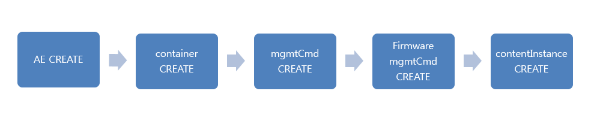
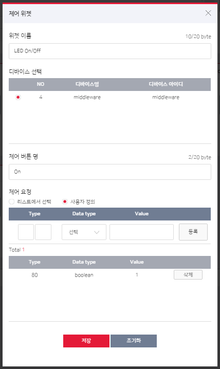
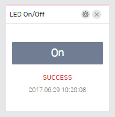

## oneM2M 등록과 주기보고 및 제어하기
본 챕터는 SKT ThingPlug Device 미들웨어를 통한 기기 등록과정과 주기보고 및 제어하기에 대하여 서술합니다.

#### 등록과 주기보고
기기등록부터 주기보고까지의 진행순서는 아래와 같습니다.



#### **등록**
* **AE Create**
  * 기기 등록
	```xml
	<?xml version="1.0" encoding="UTF-8"?>
	<m2m:rqp xmlns:m2m="http://www.onem2m.org/xml/protocols" xmlns:xsi="http://www.w3.org/2001/XMLSchema-instance" xsi:schemaLocation="http://www.onem2m.org/xml/protocols CDT-requestPrimitive-v1_0_0.xsd">
	<op>1</op>
	<fr>S</fr>
	<to>/~/middleware/v1_0</to>
	<ty>2</ty>
	<rqi>12345</rqi>
	<pc>
		<m2m:ae rn="device01">
			<api>[CREDENTIAL-ID]</api>
			<poa>mqtt://oneM2M/req_msg/middleware/sptektest1_device01</poa>
			<rr>true</rr>
			<ni>device01</ni>
			<mga>mqtt://sptektest1_device01</mga>
		</m2m:ae>
	</pc>
	</m2m:rqp>
	
	<m2m:rsp xmlns:m2m="http://www.onem2m.org/xml/protocols" xmlns:xsi="http://www.w3.org/2001/XMLSchema-instance"><rsc>2001</rsc><rqi>12345</rqi>
	<pc>
		<m2m:ae rn="ae-device01">
			<ty>2</ty>
			<ri>AE00000000000000000416</ri>
			<pi>CB00000000000000000056</pi>
			<ct>20170524T015218</ct>
			<lt>20170524T015218</lt>
			<acpi>AP00000000000000003663</acpi>
			<et>99991231T000000</et>
			<api>[CREDENTIAL-ID]</api>
			<aei>S000000000087020984416</aei>
			<poa>mqtt://oneM2M/req_msg/middleware/sptektest1_device01</poa>
			<rr>true</rr>
			<nl>ND00000000000000001979</nl>
			<ni>device01</ni>
			<mga>mqtt://sptektest1_device01</mga>
		</m2m:ae>
	</pc>
	</m2m:rsp>
	```
	


* **container Create**
  * 센서를 위한 container 등록
	```xml
	<?xml version="1.0" encoding="UTF-8"?>
	<m2m:rqp xmlns:m2m="http://www.onem2m.org/xml/protocols" xmlns:xsi="http://www.w3.org/2001/XMLSchema-instance" xsi:schemaLocation="http://www.onem2m.org/xml/protocols CDT-requestPrimitive-v1_0_0.xsd">
	<op>1</op>
	<fr>S000000000087020984416</fr>
	<to>/~/middleware/v1_0/ae-device01</to>
	<ty>3</ty>
	<rqi>12345</rqi>
	<pc>
		<m2m:cnt rn="LoRa">
		</m2m:cnt>
	</pc>
	</m2m:rqp>
	
	<m2m:rsp xmlns:m2m="http://www.onem2m.org/xml/protocols" xmlns:xsi="http://www.w3.org/2001/XMLSchema-instance">
	<rsc>2001</rsc>
	<rqi>12345</rqi>
	<pc>
		<m2m:cnt rn="cnt-LoRa">
			<ty>3</ty>
			<ri>CT00000000000000003997</ri>
			<pi>AE00000000000000000416</pi>
			<ct>20170524T015218</ct>
			<lt>20170524T015218</lt>
			<et>99991231T000000</et>
			<st>0</st>
			<cr>S000000000087020984416</cr>
			<cni>0</cni>
			<cbs>0</cbs>
		</m2m:cnt>
	</pc>
	</m2m:rsp>
	```

* **mgmtCmd Create**
  * 제어를 위한 mgmtCmd 등록
	```xml
	<?xml version="1.0" encoding="UTF-8"?>
	<m2m:rqp xmlns:m2m="http://www.onem2m.org/xml/protocols" xmlns:xsi="http://www.w3.org/2001/XMLSchema-instance" xsi:schemaLocation="http://www.onem2m.org/xml/protocols CDT-requestPrimitive-v1_0_0.xsd">
	<op>1</op>
	<fr>S000000000087020984416</fr>
	<to>/~/middleware/v1_0</to>
	<ty>12</ty>
	<rqi>12345</rqi>
	<pc>
		<m2m:mgc rn="device01">
			<cmt>1</cmt>
			<ext>ND00000000000000001979</ext>
		</m2m:mgc>
	</pc>
	</m2m:rqp>

	<m2m:rsp xmlns:m2m="http://www.onem2m.org/xml/protocols" xmlns:xsi="http://www.w3.org/2001/XMLSchema-instance">
	<rsc>2001</rsc>
	<rqi>12345</rqi>
	<pc>
		<m2m:mgc rn="mgc-device01">
			<ty>12</ty>
			<ri>MC00000000000000003586</ri>
			<pi>CB00000000000000000056</pi>
			<ct>20170524T015218</ct>
			<lt>20170524T015218</lt>
			<et>99991231T000000</et>
			<cmt>1</cmt>
			<exe>false</exe>
			<ext>ND00000000000000001979</ext>
		</m2m:mgc>
	</pc>
	</m2m:rsp>
	```

#### **주기보고**

* **contentInstance Create**
  * container의 contentInstance 등록
	```xml
	<?xml version="1.0" encoding="UTF-8"?>
	<m2m:rqp xmlns:m2m="http://www.onem2m.org/xml/protocols" xmlns:xsi="http://www.w3.org/2001/XMLSchema-instance" xsi:schemaLocation="http://www.onem2m.org/xml/protocols CDT-requestPrimitive-v1_0_0.xsd">
	<op>1</op>
	<fr>S000000000087020984416</fr>
	<to>/~/middleware/v1_0/ae-device01/cnt-LoRa</to>
	<ty>4</ty>
	<rqi>12345</rqi>
	<pc>
		<m2m:cin>
			<cnf>ttv</cnf>
			<con>120a41dc7efa3104016333050025</con>
		</m2m:cin>
	</pc>
	</m2m:rqp>
	
	<m2m:rsp xmlns:m2m="http://www.onem2m.org/xml/protocols" xmlns:xsi="http://www.w3.org/2001/XMLSchema-instance">
	<rsc>2001</rsc>
	<rqi>12345</rqi>
	<pc>
		<m2m:cin rn="cin-CI00000000000076394900">
			<ty>4</ty>
			<ri>CI00000000000076394900</ri>
			<pi>CT00000000000000003997</pi>
			<ct>20170524T015219</ct>
			<lt>20170524T015219</lt>
			<et>20170623T015219</et>
			<st>1</st>
			<cr>S000000000087020984416</cr>
			<cnf>ttv</cnf>
			<cs>2</cs>
			<con>120a41dc7efa3104016333050025</con>
		</m2m:cin>
	</pc>
	</m2m:rsp>
	```

#### 제어하기
[ThingPlug 사이트](https://thingplug.net)의 대시보드를 이용한 제어 등록 및 방법에 대한 설명입니다.

* **제어 위젯 등록하기**
  * Service > 대시보드 메뉴의 **+위젯추가** 버튼을 클릭하여 등록합니다.
  

  * 제어결과는 위젯을 통하여 확인할 수 있습니다.
  
  

Copyright (c) 2017 SK Telecom Co., Ltd. All Rights Reserved.