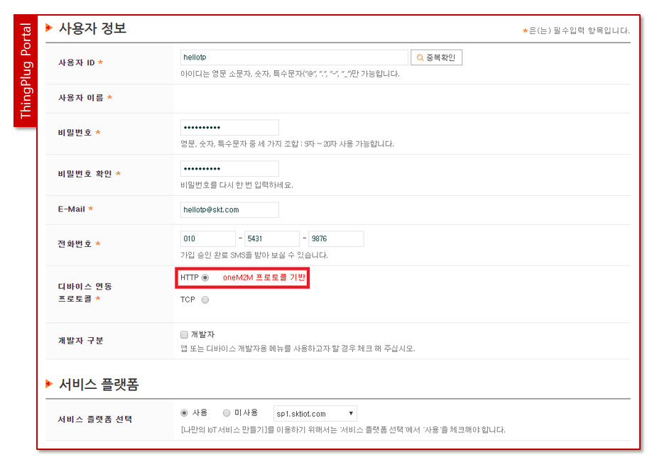
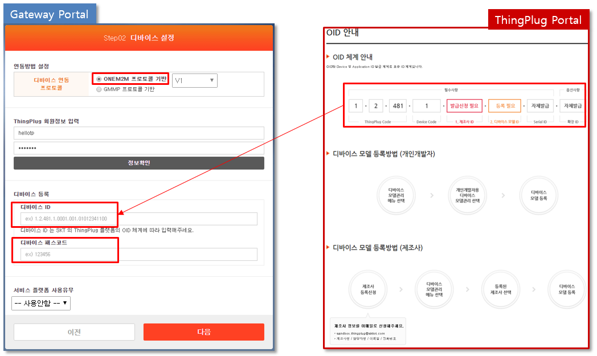
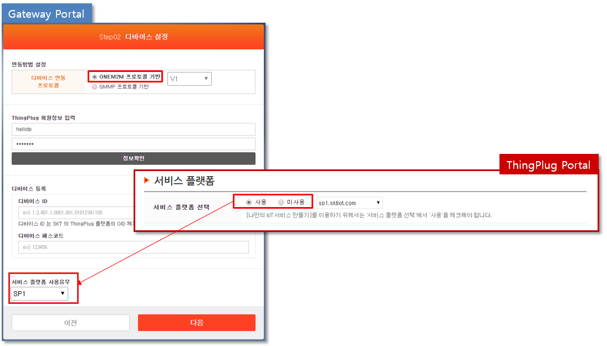
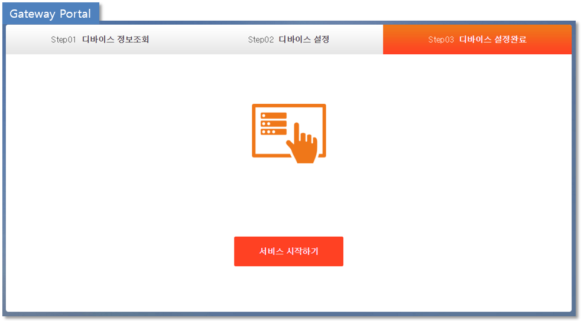

## ThingPlug Device 미들웨어 oneM2M 등록 가이드
본 챕터는 Device 를 oneM2M 방식으로 등록하는 방법을 서술한다.

#### 1. SKT ThingPlug 회원 가입
0. thingplug.sktiot.com 접속
1. oneM2M 은 디바이스 연동 프로토콜 선택에서 HTTP 를 선택한다.

#### 2. Gateway Portal 간편 세팅
* 브라우저에서 http://IP-address:8000 번으로 접속하여 로그인 한다.

#### 3. Gateway Portal 정보 확인 
0. 모델명, CPU, S/N, MAC 주소 등을 확인할 수 있다.
1. 회원가입 버튼을 통하여 ThingPlug Portal로 이동 가능하다.

#### 4. oneM2M 등록
*  ThingPlug 회원정보는 ThingPlug Portal 에서 oneM2M 으로 회원가입한 계정정보를 입력 후 정보확인 버튼을 클릭하여 확인 한다.(필수)

* 발급받은 디바이스 ID(OID) 와 디바이스 패스코드 를 입력한다.
* ThingPlug Portal 메뉴 > 개발자 지원 > OID 안내 내용을 참고한다.

* 서비스 플랫폼 사용유무는 ThingPlug 회원가입시 설정대로 처리한다.

	
* 등록이 정상적으로 완료되면 Step03 디바이스 설정완료 로 이동된다.
* 서비스 시작하기를 클릭한다.

	
* thingplug.sktiot.com 접속
* 디바이스 등록을 클릭한다.

* 장치 등록시 사용된 OID(디바이스 ID) 와 Passcode 입력 후 디바이스 정보 확인을 한다.

* 인증 성공 팝업이 발생하면 확인 후 필수 정보 입력을 진행하고, 저장하여 등록을 마무리한다.

* 등록이 성공한 디바이스는 마이페이지 > 마이 IoT 메뉴에서 아래와 같이 확인이 가능하다.

#### 5. [oneM2M-SP1 연동 가이드](oneM2M_SP1_Guide.md)
