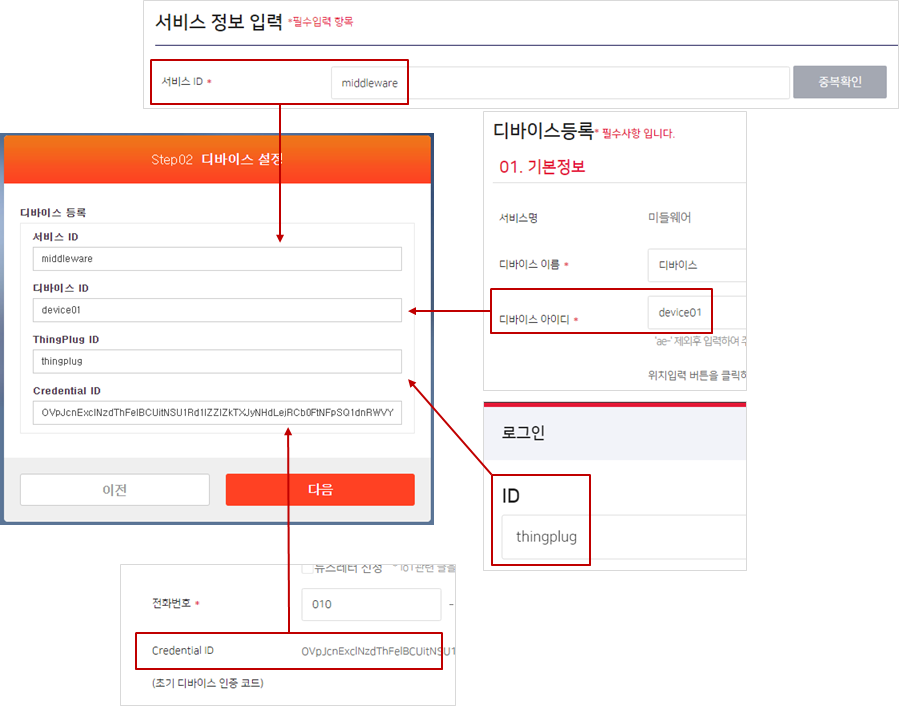
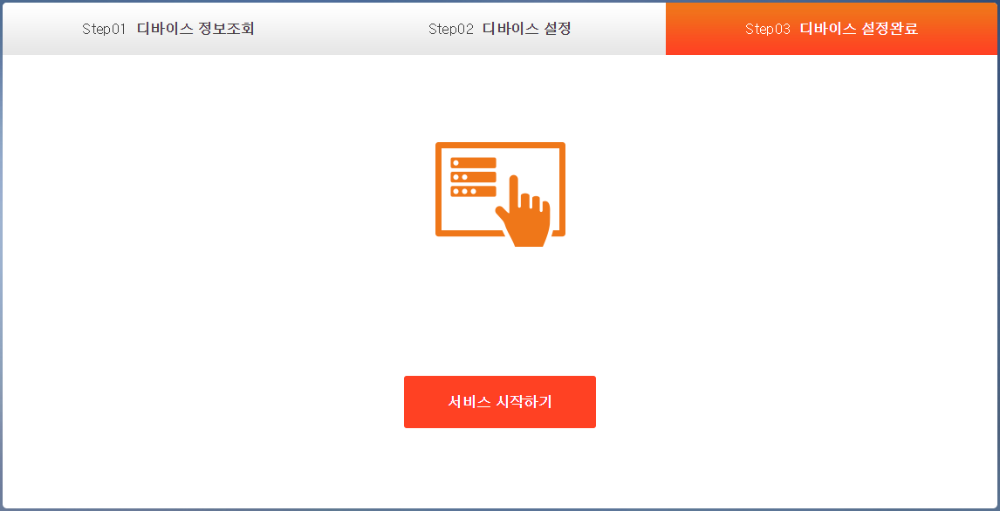
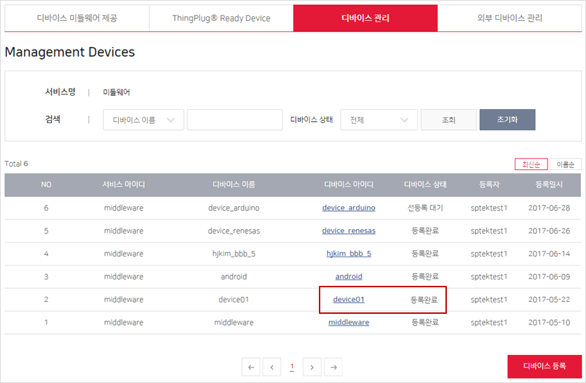

## ThingPlug 플랫폼 Device 등록 가이드
다음 안내에 따라서 기기를 등록합니다.

#### Gateway Portal 간편 세팅
* 브라우저에서 http://IP-address:8000 번으로 접속하여 `간편세팅 > 로그인` 하여 **Step01 디바이스 정보조회** 화면으로 이동합니다.
* ThingPlug 회원가입이 필요한 경우 회원가입 버튼을 통하여 가입을 진행합니다.
* 다음 버튼을 클릭합니다.

#### 기기 등록
*  **Step02 디바이스 설정** 화면에서 기기를 등록합니다.
*  서비스 ID 는 ThingPlug Portal `회원가입 > 서비스 매니저 가입하기 > 서비스 정보 입력 > 서비스 ID` 값과 동일하게 설정합니다.
*  디바이스 ID 는 ThingPlug Portal `Develop > 디바이스 연동 > 디바이스 관리 > 디바이스 등록 > 디바이스 아이디` 값과 동일하게 설정합니다.
*  ThingPlug ID 는 ThingPlug Portal `로그인 아이디` 로 설정합니다.
*  Credential ID 는 ThingPlug Portal `My page > 회원정보수정 > Credential ID` 값과 동일하게 설정합니다.

#### 기기 등록 완료
* 등록이 정상적으로 완료되면 **Step03 디바이스 설정완료** 로 이동됩니다.
* 서비스 시작하기를 클릭합니다.

* 등록이 성공한 기기는 ThingPlug Portal `Develop > 디바이스 연동 > 디바이스 관리` 메뉴에서 아래와 같이 확인이 가능합니다.

Copyright (c) 2017 SK Telecom Co., Ltd. All Rights Reserved.