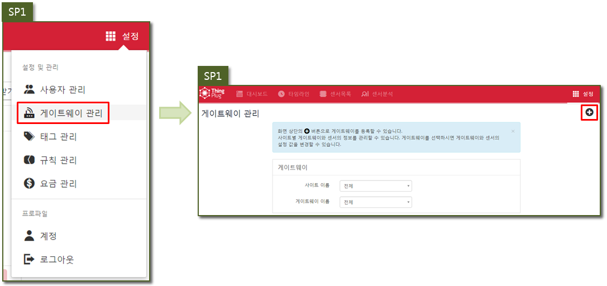
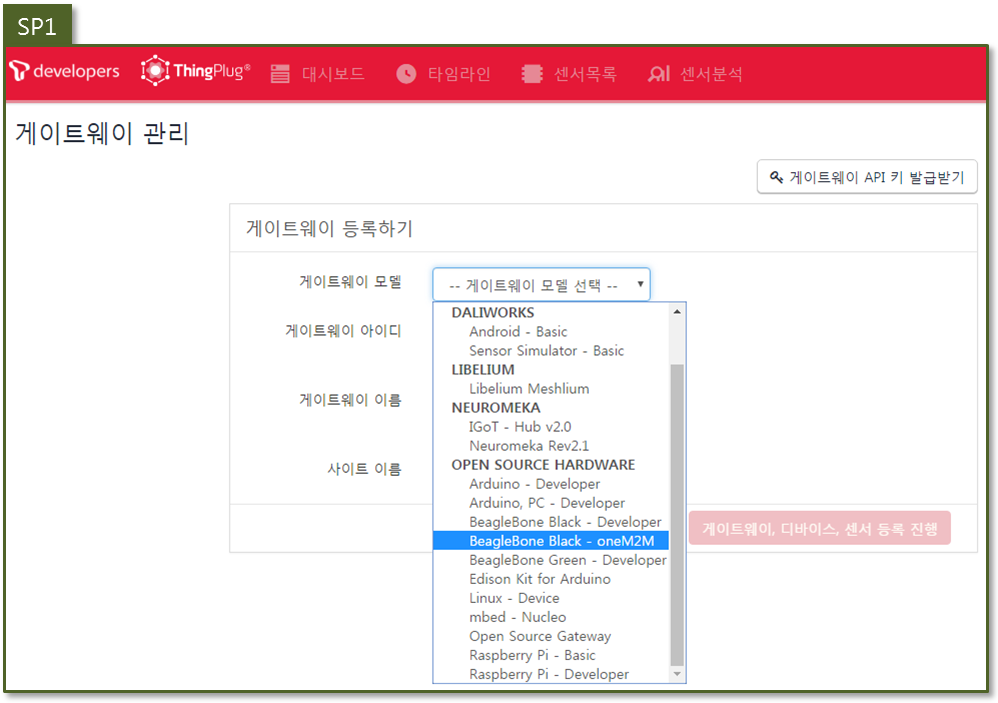
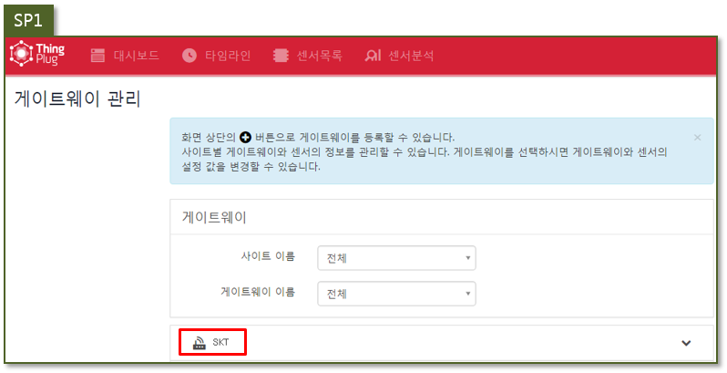

## ThingPlug Device 미들웨어 oneM2M-SP1 연동 가이드
본 챕터는 oneM2M 과 SP1 연동 방법을 서술한다.

#### 1. oneM2M-SP1 연동
* ThingPlug Portal 에 디바이스 등록이 완료된 후 진행한다.
* openhw.sp1.sktiot.com/ 접속 및 로그인 후 게이트웨이 등록을 진행한다.

* 등록하고자 하는 게이트웨이에 맞는 모델을 선택한다. 
* 해당되는 모델이 없을 경우, 서비스 관리자에게 문의하여 모델 추가를 요청한다.

* 나머지 입력란은 아래 예시에 맞추어 입력해 준다.

* 센서 추가는 아래와 같이 Gateway Portal 의 센서정보를 참고하여 추가한다.
* 입력이 완료되면 게이트웨이, 디바이스, 센서 등록 진행 버튼을 통하여 등록을 완료한다.

* 등록이 완료되면 게이트웨이 관리 메뉴에서 확인이 가능하다.

* 대시보드에 게이트웨이/센서/액츄에이터를 다음과 같은 과정으로 추가해준다.

